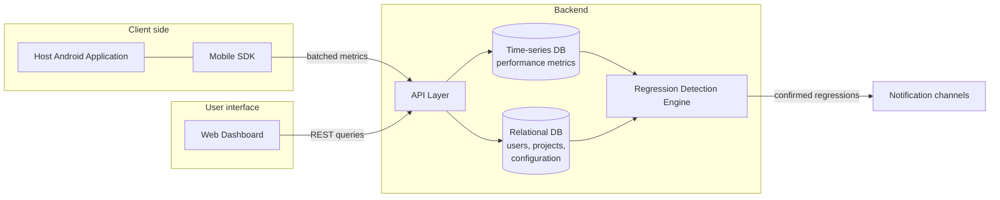

<div align="center">

# PerfX

**Performance monitoring and regression detection system for Android applications.**

[](https://kotlinlang.org/)
[](https://ktor.io/)
[](https://clickhouse.com/)
[](https://www.postgresql.org/)
[](https://streamlit.io/)
[](https://www.docker.com/)

</div>

---

## Overview

PerfX collects runtime performance metrics from Android applications via an embeddable SDK, stores them in a time-series backend, and automatically detects performance regressions between releases. Results are exposed through a web dashboard for inspection and release decisions.

## Architecture



### Components

| Component | Path | Stack | Responsibility |
|-----------|------|-------|----------------|
| **Android SDK** | [Android/PerfX/sdk](Android/PerfX/sdk) | Kotlin, Android | Collects performance metrics on-device and ships them to the backend. |
| **Demo app** | [Android/PerfX/demo](Android/PerfX/demo) | Kotlin, Android | Reference integration of the SDK. |
| **Backend** | [Backend/app](Backend/app) | Kotlin, Ktor | REST API for metric ingestion, user / app / release management. |
| **Regression detector** | [Analysis](Analysis) | Python | Compares performance between releases and flags regressions. |
| **Frontend** | [Frontend](Frontend) | Python, Streamlit | Web dashboard for metrics and regression reports. |

---

## Getting Started

### Prerequisites

- Docker & Docker Compose
- JDK 17+ (for building the Android SDK locally)
- Android Studio (for the demo app)
- Python 3.10+ (for the frontend and analysis)

### 1. Start the backend

```bash
cd Backend
docker compose up --build
```

This starts PostgreSQL (`:5432`), ClickHouse (`:8123`, `:9000`) and the Ktor backend (`:8080`).

### 2. Start the frontend

```bash
cd Frontend
pip install -r requirements.txt
streamlit run app.py
```

The dashboard is available at `http://localhost:8501`.

### 3. Build and run the Android demo

```bash
cd Android/PerfX
./gradlew :demo:installDebug
```

Or open `Android/PerfX` in Android Studio and run the `demo` module.

### 4. Run the regression detector

```bash
cd Analysis
pip install -r requirements.txt
python regression_detector.py
```

Notebooks [analysis.ipynb](Analysis/analysis.ipynb) and [evaluation.ipynb](Analysis/evaluation.ipynb) contain exploratory analysis and evaluation of the detector.

---

## Project Structure

```
PerfX/
├── Android/         # Android SDK and demo app
├── Backend/         # Ktor backend, ClickHouse, PostgreSQL, docker-compose
├── Frontend/        # Streamlit dashboard
├── Analysis/        # Regression detection and evaluation notebooks
└── Demo/            # Sample Android apps used for testing (2048, Paint)
```
